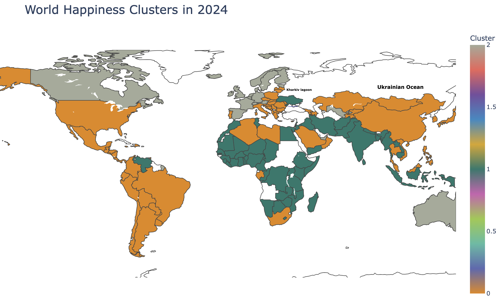

# HappyLens

## Project Overview

**HappyLens** is a data science project designed to explore happiness levels across countries, visualize patterns, and predict national happiness scores. Using real data from the World Happiness Report, the project  combines data analysis, machine learning, and a user-friendly CLI tool for country recommendation.


## Objectives

- Understand global happiness trends using historical data.
- Explore and visualize factors influencing happiness across the world.
- Cluster countries based on key well-being indicators.
- Build a model to predict happiness scores using multiple regression models (e.g., for Ukraine).
- Recommend top countries to users based on customized priorities.

## Project Structure

```
HappyLens/
├── cli/                       # CLI tool for country recommendation
│   └── main.py
├── data/                     # Raw datasets and preprocessing notebook
│   ├── World Happiness Report.csv
│   ├── happiness_data.csv
│   └── data_preprocessing.ipynb
├── data_analysis/            # EDA and clustering
│   └── data_analysis.ipynb
├── model_what_if/            # Happiness prediction models
│   └── happiness_predictor.ipynb
├── README.md
├── requirements.txt         # Python dependencies
```

## Features

- **Exploratory Data Analysis (EDA)**: PCA, correlation matrix, visual summaries.
- **Clustering**: KMeans-based grouping of countries by happiness-related features.
- **Prediction Models**: Four machine learning regressors to predict happiness scores.
- **Interactive CLI Tool**: Users assign importance (weights) to happiness factors and receive a ranked list of recommended countries.
- **Feature Engineering**: Removal of irrelevant features. Standardization via StandardScaler. PCA applied before clustering.


## Tech Stack

- **Language**: Python 3
- **Jupyter Notebook** for analysis and modeling
- **Data**: World Happiness Report 2024
- **ML Models**:
  - `RandomForestRegressor`
  - `LinearRegression`
  - `GradientBoostingRegressor`
  - `XGBRegressor` (via `xgboost`)
- **Libraries**: `pandas`, `matplotlib`, `seaborn`, `plotly`, `scikit-learn`, `xgboost`, `argparse`


## Results

- Clustered countries into 3 groups based on well-being metrics.
- Interactive map of happiness: created with the help of Plotly, it allows to visually explore the level of happiness in countries around the world.
- Ukraine's 2024 happiness score was predicted using trained regression models.
- All four models successfully predicted happiness scores for 2024 with low error rates.
- Feature importance analysis revealed the most influential factors.
- Enabled simulations of “what-if” scenarios (e.g., increased GDP, improved social support).
- The CLI tool personalizes recommendations based on user preferences and subjective factor weights.




## How to Use

### Country Recommendation CLI

```bash
cd HappyLens/cli
python main.py
```

- Input your preferences (weights between 0 and 1) for six key factors.
- The system ranks countries based on your customized happiness score.
- Returns the **Top-10 countries** best aligned with your values.

```Please enter weights for each factor (between 0 and 1).
GDP: 1
SocialSupport: 1
LifeExpectancy: 1
Freedom: 1
Generosity: 1
Corruption: 1

Your personalized Top-10 countries based on your weights:
    Country  HappinessScore  Score
  Singapore           6.565  6.064
     Norway           7.262  6.031
    Denmark           7.521  5.986
     Sweden           7.345  5.959
    Finland           7.736  5.954
    Ireland           6.889  5.937
 Luxembourg           7.122  5.895
Switzerland           6.935  5.888
    Iceland           7.515  5.857
Netherlands           7.306  5.723
```


### Explore EDA and Modeling

Open the notebooks in Jupyter:

- `data_analysis/data_analysis.ipynb`: Explore global patterns and clustering.
- `model_what_if/happiness_predictor.ipynb`: Train and evaluate predictive models.


## Inspiration

This project aims to go beyond generic happiness rankings by making the analysis personal, interactive, and actionable.
	*"There is no universal formula for happiness — but there can be a data-driven guide to help find your 	own."*


